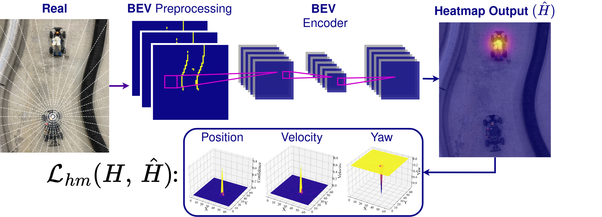

# TinyCenterSpeed
[](https://arxiv.org/abs/xxxx.xxxxx)


This module implements __TinyCenterSpeed__. A lightweight adaptation of state-of-the art machine learning algorithms for object detection. The module is implemented as part of the *ForzaETH* race-stack. 

__TinyCenterSpeed__ provides a framework for data generation, preprocessing, training, inference and hardware optimization for the hardware of an *F1TENTH* racecar.

 

## Key Features
- __Machine Learning__: Learning-based approach for perception in autonomous racing.
- __High Accuracy__: TinyCenterSpeed shows state-of-the-art performance, improving previous methods by as much as __61.38%__.
- __High Performance__: TinyCenterSpeed is deployable on off-the-shelf hardware accelerators, achieving real time inference in just __7.88ms__.
- __Experimental Validation__: Tested on a 1:10 scale autonomous racing platform with a robust comparison to state-of-the-art algorithms.

## Overview
* [Dataset](./dataset/): Framework for generating and processing LiDAR data for ML applications with computer-vision. The complete dataset can be found [here](https://drive.google.com/drive/folders/1J7F0DwQHq2D1mbMrkqY8PqFb8sGw4_mQ?usp=drive_link).
* [Environments](./environments/): Provides the environments used for training.
* [Models](./src/models/): The detailed model definitions.
* [Train](./src/train/): Provides functionality to train the model. Also contains example usage of the dataset pipeline.
* [Pretrained models](./src/trained_models/): Provides pretrained models for direct use.
* [Inference](./src/): Inference code compatible with the *ForzaETH* race-stack.

## Installation
__TinyCenterSpeed__ is part of the [ForzaETH Race Stack](https://github.com/ForzaETH/race_stack). Please refer to the [installation guide](https://github.com/ForzaETH/race_stack/blob/main/INSTALLATION.md) for detailed instructions and perform the quickstart guide below to run the system.

## Quickstart Guide

Running inference requires the following data to be available in the form of ROS messages:

```
/scan
/global_waypoints
/car_state/odom_frenet
/dynamic_tracker_server/parameter_updates
```
To easily try TinyCenterSpeed, launch one of the example Rosbags available [here](https://drive.google.com/drive/folders/1hZCZDIbE9WW18jJVNv3GZEZ9zcEqLSpz?usp=drive_link).

Play the bag with:

```
rosbag play <path_to_bag>
```

Running inference is as simple as launching the node with one of the provided launchfiles, either with or withouth tracking using a Kalman Filter.

⚠️Remember to adapt the number of detectable opponents in the cfg. Setting the number too high will have no bad effect.⚠️

```
roslaunch tcs TCS.launch
```
or
```
roslaunch tcs TCS_tracking.launch
```
Launch a visualisation tool like RVIZ or Foxglove. To see the results, viusalize the topics */perception/obstacles_markers_new*, */map*, */scan*.

As part of the ForzaETH Race Stack, TinyCenterSpeed can also be run integrated in the Head-to-head mode.
Please refer to the Race Stack for detailed usage. 

## Contributing
TinyCenterSpeed is available under the MIT license.
In case you found TinyCenterSpeed helpful and want to contribute, please either raise an issue or directly make a pull request.

## Citing TinyCenterSpeed
If you found TinyCenterSpeed useful in your research, we would appreciate to cite it as follows:

__TODO!!!__
