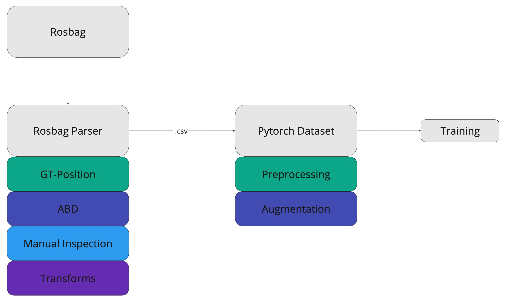
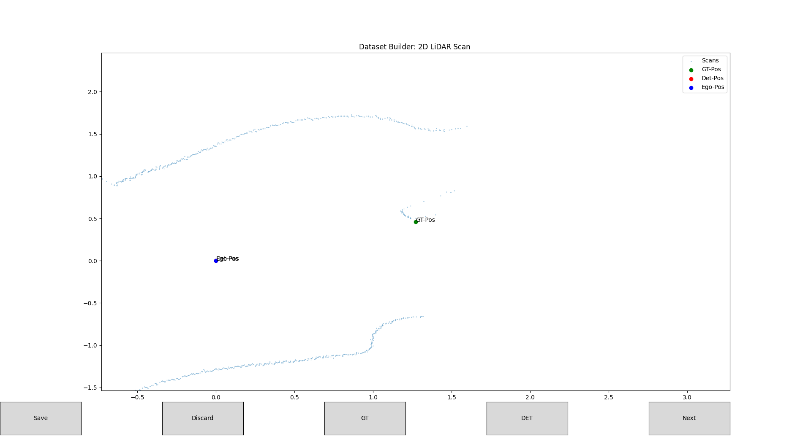
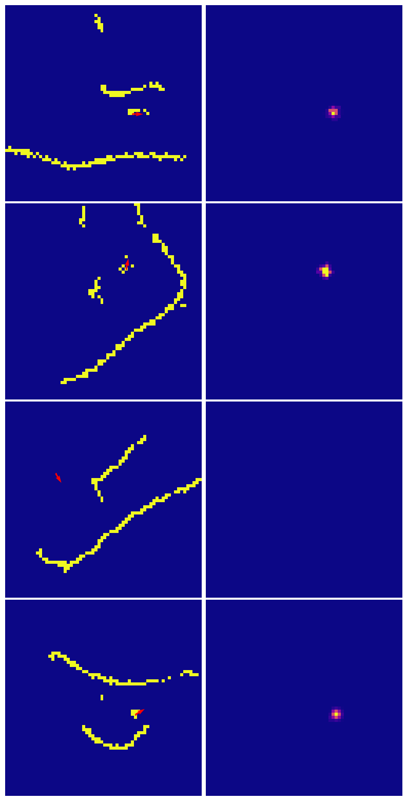
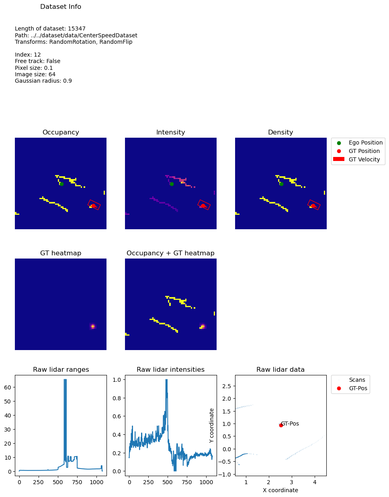

# Perception Dataset

This part of the perception package provides a pipeline for converting data from a Rosbag into a Pytorch dataset.



## How it works

The class extracts data such as ground-truth positions and velocities as well as laser-scans from a Rosbag. The scans are additionally verified through the adaptive breakpoint method. From observation it seems that the detected positions are more accurate, while the GT-positions from the Rosbag are more stable. The class uses this property to build a more precise dataset, combining these two methods together with manual inspection.
If the two GT's diverge too much, a window is launched, where the user can choose to either use the detected GT, the GT from the bag or place a point on the plot manually. An example from the user interface is shown below.




## Prerequisites
In order to use the dataset builder, the Rosbag to be parsed should contain the following topics (names specific to the race-stack):
```
/scan
/car_state/odom
/car_state/odom_frenet
/opp/car_state/odom
/opp/car_state/odom_frent
/transform
/transform_static
```

## How to Use

### Use Prebuilt Dataset

A prebuilt dataset to train can be downloaded from [Google Drive](https://drive.google.com/drive/folders/1mOTTbe_c-zF-jpJSAEBBQ4GXqd6FngKm?usp=sharing). 

Load the dataset at the following location:
```
perception/
├─ CenterSpeed/
│  ├─ dataset/
│  │  ├─ data/

```

### Build the CSV file
Run `rosrun tcs dataset.py` with the following arguments:
```yaml
--bag (str): the filename of the bag
--output (str): the output filename for the csv file, default is bag_name.csv
--start (int): the start time in seconds when the bag should be parsed
--end (int): the end time in seconds when the bag should be parsed
--correct: enables the correction ability 
--speedy: enables speed mode for manual placement
--only_gt: only chooses the gt values transmitted from the opponent

Example:

rosrun tcs dataset.py --bag test.bag --output test.csv --start 0 --end 1 --correct --speedy --only_gt
```
The CSV file will be stored under `CURRENT_DIR/dataset_output/OUTPUT_NAME.csv`

### Use the PyTorch Dataset

The Pytorch dataset `CenterSpeedDataset` is implemented in `CenterSpeed_dataset.py`.
The dataset is implemented completely on-demand and expects a folder containing one or multiple CSV files following the structure given by the dataset builder. The CSV files are expected to __not__ have a header. See `utils/dataset_utils.ipynb` to remove the headers from the files.

CenterSpeedDataset has the following functionalities:

* __len()__: returns the length of the dataset.
* __RandomRotation(angle, image_size=64, feature_size=64)__: randomly rotates a dataset entry by an angle between (-angle, angle).
* __RandomFlip(p)__: randomly flips a dataset entry along the x-axis with probability p. 
* __getitem(index)__: returns the preprocessed and transformed dataset entry.
* __change_pixel_size(pixel_size)__: changes the pixel size returned by the dataset.
* __change_image_size(image_size)__: changes the image size returned by the dataset.
* __visualize(index, show_preprocessed=True, show_gt=True, show_raw=True)__: visualizes the first frame of an entry at index in the dataset.

CenterSpeedDataset returns:
* the 6 dimensional input feature map of squared size image_size.
* the ground truth heatmap of squared size image_size.
* the 5 ground truth values for: $x$,$y$,$v_x$,$v_y$ and orientation angle in radians.
* a boolean indicating wether the track should be free or not.

Example usage:
```python
transform = transforms.Compose([RandomRotation(45), #Define the transforms
                                RandomFlip(0.5)])

set = CenterSpeedDataset('../../dataset/data/CenterSpeedDataset', transform=transform)
set.seq_len = 2 # set the number of sequential frames
set.sx = 0.9 # set the radius of the gt-peaks
set.sy = 0.9
set.change_image_size(64) # set the image size
set.change_pixel_size(0.1) # set the pixel size

set.visualize(12)#visualize the dataset

input, gt, data, is_free = set[0] # retrieve an entry

training_loader = DataLoader(set, batch_size=batch_size, shuffle=True) # use with torch datalodader

```

Some examples returned by the dataset are shown below:



Example output from the visualize function:


---

## Lidar Dataset

The LidarDataset in `lidar_dataset.py` provides functionality to use the raw lidar scans as a dataset from the CSV files following the structure given by the dataset builder. It is significantly less memory efficient since the entirity of the dataset is loaded. This is addressed in LidarDatasetOD, which is __not__ fully implemented!

The LidarDataset provides the following functionalities:
* __len()__: returns the length of the dataset. 
* __getitem()__: returns the potentially preprocessed dataset entry.
* __add_data(csv-file)__: adds CSV data to the dataset.
* __augment()__: augments the lidar scans by flipping them and adding them to the dataset.
* __preprocess()__: preprocesses the whole dataset into images.
* __heatmap()__: preprocesses all ground truth positions into heatmaps.
* __vis(index, point=[0,0])__: visualizes a raw lidar scan at index. If no point is specified, the ego-position is shown, otherwise the point is plotted and the error is shown.
* __vis_preprocessed(index)__: visualizes the preproceesed scans at index.
* __vis_heatmap(index)__: visualizes the ground truth heatmap at index.

Example usage:
```python

set = LidarDataset(dataset_path="...")#initialize dataset
set.add_data(csv_file="...")#add data
set.add_data(csv_file="...")#add data

set.augment()#Data augmentation
#if data should be preprocessed:
set.preprocess()#preprocess lidar scans
set.vis_preprocessed(index=10)#visualize preprocessed scan
set.heatmap()#create ground truth heatmaps
set.vis_heatmap(index=10)#visualize ground truth heatmap

set.vis(10)#visualize raw data

lidar,intensities,data = set[0]


```

# Details
In the following table the exact hyperparameters for each collection run are listed.

| Name ROSbag                    | Name CSV                       | Date       | m_ego | m_opp | Properties  | Map Name         |
|-------------------------------|--------------------------------|------------|-------|--------|-------------|------------------|
| 06_04_Dataset02.bag           | 06_04_Dataset02.csv           | 06.04.2024 | 0.5   | 0.4    | trailing    | 06_04_Dataset02  |
| 06_04_Dataset02_Front.bag     | 06_04_Dataset02_Front.csv     | 06.04.2024 | 0.4   | 0.4    | free track  | 06_04_Dataset02  |
| 06_04_Dataset03.bag           | 06_04_Dataset03.csv           | 06.04.2024 | 0.5   | 0.4    | trailing    | 06_04_Dataset03  |
| 06_04_Dataset03_Front.bag     | 06_04_Dataset03_Front.csv     | 06.04.2024 | 0.4   | 0.4    | free track  | 06_04_Dataset03  |
| 06_04_Dataset04.bag           | 06_04_Dataset04.csv           | 06.04.2024 | 0.5   | 0.4    | trailing    | 06_04_Dataset04  |
| 06_04_Dataset04_Front.bag     | 06_04_Dataset04_Front.csv     | 06.04.2024 | 0.4   | 0.4    | free track  | 06_04_Dataset04  |
| 06_04_Dataset05.bag           | 06_04_Dataset05.csv           | 06.04.2024 | 0.5   | 0.4    | trailing    | 06_04_Dataset05  |
| 25_04_Dataset01_10s.bag       | 25_04_Dataset01_10s.csv       | 25.04.2024 | 0.5   | 0.4    | trailing    | 25_04_Dataset01  |
| 25_04_Dataset01_Manual_10s.bag| 25_04_Dataset01_Manual_10s.csv| 25.04.2024 | 0.5   | -      | manual      | 25_04_Dataset01  |
| 25_04_Dataset01_FTG_10s.bag   | 25_04_Dataset01_FTG_10s.csv   | 25.04.2024 | 0.5   | 0.4    | FTG         | 25_04_Dataset01  |
| 25_04_Dataset02_10s.bag       | 25_04_Dataset02_10s.csv       | 25.04.2024 | 0.5   | 0.4    | trailing    | 25_04_Dataset02  |
| 25_04_Dataset02_Manual_10s.bag| 25_04_Dataset02_Manual_10s.csv| 25.04.2024 | 0.5   | -      | manual      | 25_04_Dataset02  |
| 25_04_Dataset02_FTG_10s.bag   | 25_04_Dataset02_FTG_10s.csv   | 25.04.2024 | 0.5   | 0.4    | FTG         | 25_04_Dataset02  |
| 25_04_Dataset03_10s.bag       | 25_04_Dataset03_10s.csv       | 25.04.2024 | 0.5   | 0.4    | trailing    | 25_04_Dataset03  |
| 25_04_Dataset03_Manual_10s.bag| 25_04_Dataset03_Manual_10s.csv| 25.04.2024 | 0.5   | -      | manual      | 25_04_Dataset03  |
| 25_04_Dataset03_FTG_10s.bag   | 25_04_Dataset03_FTG_10s.csv   | 25.04.2024 | 0.5   | 0.4    | FTG         | 25_04_Dataset03  |
| 25_04_Dataset04_10s.bag       | 25_04_Dataset04_10s.csv       | 25.04.2024 | 0.5   | 0.4    | trailing    | 25_04_Dataset04  |
| 25_04_Dataset04_Manual_10s.bag| 25_04_Dataset04_Manual_10s.csv| 25.04.2024 | 0.5   | -      | manual      | 25_04_Dataset04  |
| 25_04_Dataset04_FTG_10s.bag   | 25_04_Dataset04_FTG_10s.csv   | 25.04.2024 | 0.5   | 0.4    | FTG         | 25_04_Dataset04  |
| 25_04_Dataset04_Fast_10s.bag  | 25_04_Dataset04_Fast_10s.csv  | 25.04.2024 | 0.6   | 0.5    | FTG         | 25_04_Dataset04  |
| 16_05_Dataset01.bag           | 16_05_Dataset01.csv           | 16.05.2024 | 0.7   | 0.6    | trailing    | 16_05_Dataset01  |
| 16_05_Dataset02.bag           | 16_05_Dataset02.csv           | 16.05.2024 | 0.3   | 0.2    | trailing    | 16_05_Dataset01  |
| 16_05_Dataset03.bag           | 16_05_Dataset03.csv           | 16.05.2024 | 0.5   | 0.4    | trailing    | 16_05_Dataset01  |
| 16_05_Dataset04.bag           | 16_05_Dataset04.csv           | 16.05.2024 | 0.7   | 0.6    | trailing    | 16_05_Dataset02  |
| 16_05_Dataset05.bag           | 16_05_Dataset05.csv           | 16.05.2024 | 0.3   | 0.2    | trailing    | 16_05_Dataset02  |

This table contains detailed information and metadata about the \acrshort{ros}-bags and corresponding CSV files used to train *TinyCenterSpeed*. $m_{ego}$ and $m_{opp}$ correspond to the velocity multipliers for the velocity given by the raceline.
