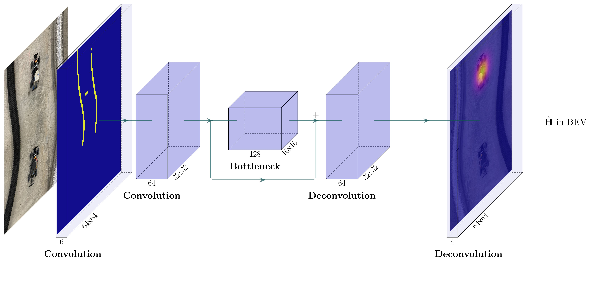

# CenterSpeed
---



This module implements __TinyCenterSpeed__. A lightweight adaptation of state-of-the art machine learning algorithms for object detection.
In the race-stack it is part of the perception package. The stable version is comprised of:

* `CenterSpeed_inference.py`
* `CenterSpeed_tracking.py`

`CenterSpeed_inference.py` implements the base functionality of CenterSpeed to run inference for the *F1TENTH* racecar. It can be additionally complemented with the tracking module containing a Kalman filter in CenterSpeed_tracking.py.

Inference on a Jetson GPU via TRT is currently __*not*__ fully supported. See this [implementation](CenterSpeed_inference_GPU_trt.py).

---

### Topics

`CenterSpeed_inference.py` __subscribes__ to:
```
/scan
/global_waypoints
/car_state/odom_frenet
/dynamic_tracker_server/parameter_updates
```

and __publishes__:
```
/detect_bound
/perception/raw_obstacles
/perception/obstacles_markers_new
/perception/velocity_marker
/perception/raw_obstacles (If traking is enabled)
/perception/obstacles: (If tracking is disabled)
/perception/detection/latency
/perception/obstacle_v_cartesian (If measuring)
```

`CenterSpeed.tracking.py` __subscribes__ to:
```
/perception/obstacles_centerspeed
/global_waypoints
/car_state/odom_frenet
/car_state/odom
/scan
/dynamic_tracker_server/parameters_updates
```
and __publishes__:
```
/perception/static_dynamic_marker_pub
/perception/obstacles
/perception/raw_obstacles
/perception/tracking/latency
```

### Configuration

To cofigure TinyCenterSpeed for inference, see [here](../config/README.md).